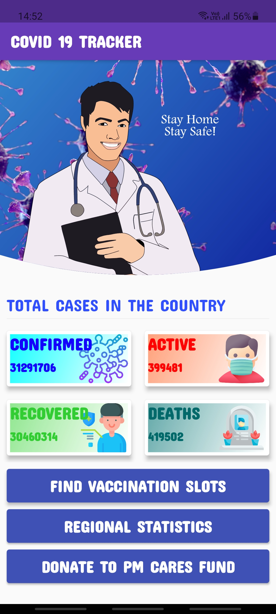
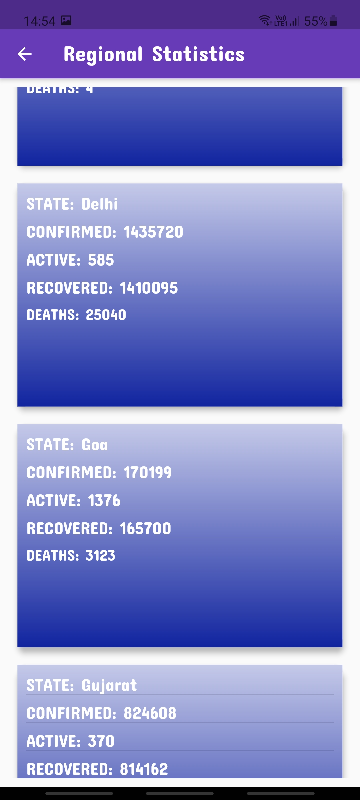
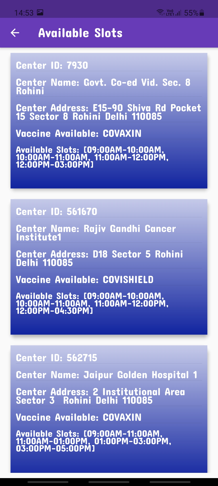

# Covid19_Tracker_Dashboard

 * A Covid19 Tracker Dashboard which displays the Real time covid cases in India using FLutter and Dart which includes the functionality of finding slots for the vaccination using the postal pinCode of the region and displaying the Confirmed, Active, Recovered, and Deaths cases for each State and the Union Territories.
     
     * HOME SCREEN
  
          
 
 
     * REGIONAL (STATEWISE) STATISTICS

          
 
     * FINDING VACCINATION SLOTS.

                   

### APIs Used
   * Covid19 India: [https://api.covid19india.org/data.json](https://api.covid19india.org/data.json)
   
   * API SETU: [https://apisetu.gov.in/public/marketplace/api/cowin#/Appointment%20Availability%20APIs/findByPin](https://apisetu.gov.in/public/marketplace/api/cowin#/Appointment%20Availability%20APIs/findByPin)

## Getting Started

A few resources to get you started with your first Flutter project:

- [Lab: Write your first Flutter app](https://flutter.dev/docs/get-started/codelab)
- [Cookbook: Useful Flutter samples](https://flutter.dev/docs/cookbook)

For help getting started with Flutter, view
[online documentation](https://flutter.dev/docs), which offers tutorials,
samples, guidance on mobile development, and a full API reference.
