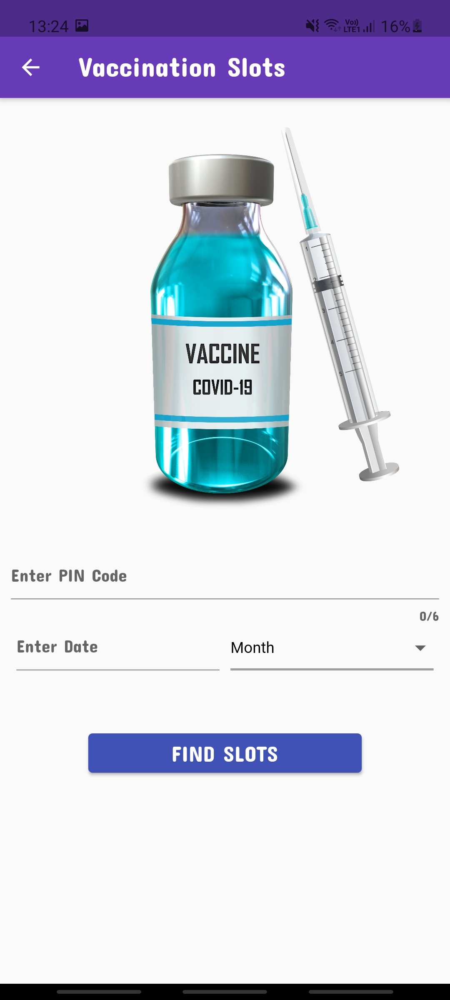

# Covid19_Tracker_Dashboard
=======

 * A Covid19 Tracker Dashboard which displays the Real time covid cases in India using FLutter and Dart
 
 
 
 
 * Viewing statewise cases also available
 
 *
 
 * Can also find the availability of vaccination slots using postal pincode

  

### APIs Used
   * Covid19 India: [https://api.covid19india.org/data.json](https://api.covid19india.org/data.json)
   
   * API SETU: [https://cdn-api.co-vin.in/api/v2/appointment/sessions/public/findByPin?pincode=110001&date=31-03-2021](https://cdn-api.co-vin.in/api/v2/appointment/sessions/public/findByPin?pincode=110001&date=31-03-2021)

## Getting Started

A few resources to get you started with your first Flutter project:

- [Lab: Write your first Flutter app](https://flutter.dev/docs/get-started/codelab)
- [Cookbook: Useful Flutter samples](https://flutter.dev/docs/cookbook)

For help getting started with Flutter, view
[online documentation](https://flutter.dev/docs), which offers tutorials,
samples, guidance on mobile development, and a full API reference.
>>>>>>> 546c091 (Added Files via commit)
=======
